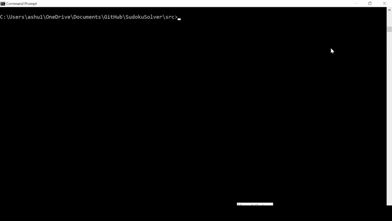

# :1234: SUDOKU SOLVER

## :open_book: OVERVIEW
Date: March 2024\
Developer(s): Ashneet Rathore\
Based on assignment instructions from Prof. Kalev Kask

Sudoku Solver is a program that uses AI-based constraint satisfaction techniques, such as heuristics and backtracking search, to efficiently solve Sudoku boards. Users can supply their own board or generate one, select different solving heuristics, and receive the completed board along with statistics tracking the algorithm's solving performance.

## :film_strip: DEMO


## :gear: HOW IT WORKS
Written in **Python**, the program models a Sudoku board as a **Constraint Satisfaction Problem (CSP)**. A CSP is a type of problem where variables must be assigned values from specificied domains such that all constraints, or rules, are satisfied. In Sudoku, each cell is represented as a variable, and its domain consists of all digits still allowed based on the current state of its row, column, or subgrid. The constraints are simply the rules of Sudoku - each digit can appear exactly once per row, column, and subgrid. As the solver progresses and neighboring assignments are made, the domain for each cell is continually reduced, thus shrinking the search space and moving the solver to a consistent, or legal, completed state.

The solver uses **backtracking search**, a variation of depth-first search, to incrementally assign values to variables while checking for consistency at each step. If a constraint violation occurs, the search retreats and explores alternative assignments. To implement the backtracking mechanism, the solver maintains a trail, or a **stack data structure**, that records every reversible change (assignments and domain prunings). When backtracking is required, the solver pops these records, restoring the search to the most recent consistent state. 

To improve efficiency, combinations of different **heuristics** can be applied (if specified by the user) to reduce the search space, prioritize assignments that are less likely to cause constraint violations, and eliminate invalid solutions earlier. The following details the types of heuristics applied:

1. Variable selection heuristics determine which unassigned variable to assign next.
    - **Minimum Remaining Value (MRV)** selects the unassigned variable with the smallest domain (with the fewest legal values).
    - **Minimum Remaining Value with Maximum Degree (MAD)** extends the MRV heuristic by applying a tie-breaking rule that selects the most constrained variable (with the most unassigned neighbors) when multiple variables share the smallest domain.

2. Value selection heuristics determine which value, for a selected variable, to assign next.
    - **Least Constraining Value (LCV)** chooses the value that restricts the fewest options for neighboring variables.

3. Consistency checking heuristics check that an assignment does not violate any constraints.
    - **Forward Checking (FC)** eliminates illegal values from neighbors after each assignment.
    - **Norvig Checking (NOR)** extends the FC heuristic by additionally assigning values that have only one possible position within a constraint.

By combining CSP modeling, backtracking, and heuristics, the program efficiently prunes the search space to find a valid Sudoku board.

## :open_file_folder: PROJECT FILE STRUCTURE
```bash
SudokuSolver/
│── src/
│   │── main.py                 # Takes user input and runs solver
│   │── sudoku_board.py         # Defines SudokuBoard class (represents board)
│   │── bt_solver.py            # Defines BTSolver class (applies heuristics and solves board)
│   │── constraint_network.py   # Defines ConstraintNetwork class (represents board as CSP)           
│   │── constraint.py           # Defines Constraint class (represents CSP constraint btwn cells)
│   │── domain.py               # Defines Domain class (represents domain of a cell)
│   │── variable.py             # Defines Variable class (represents variable, or cell, in CSP)
│   │── trail.py                # Defines Trail class (tracks assignment for backtracking)
│   └── board_generator.py      # Generates random board(s)
│── README.md                   # Project documentation
│── .gitignore                  # Excludes files and folders from version control
└── demo.gif                    # GIF showing the sudoku solving demo
```
## :rocket: SET UP & EXECUTION
**1. Clone the repository**
```bash
git clone https://github.com/ashneetrathore/SudokuSolver.git
```

**2. Run the program**
> [!IMPORTANT]
> This runs the solver using default options without any heuristics applied. For details specifying heuristics and other options,   see the next section.
```bash
cd SudokuSolver/src
python3 main.py
```


## :wrench: TRY IT OUT

### :hammer: **Board Generation Options**
To generate unsolved boards with custom options, run `board_generator.py` with the following command format
```bash
python3 board_generator.py <base_file_name> <num_boards> <p> <q> <m>
```
`base_file_name` is the base name for the generated `txt` files containing the boards. Each file will be saved with this base name followed by an underscore and a number.\
`num_boards` is the number of boards to generate.\
`p` is the number of rows in a subgrid.\
`q` is the number of columns in a subgrid.\
`m` is the number of pre-filled cells in the board.

Here are some typical Sudoku board sizes, their corresponding `p`x`q` subgrid dimensions, and the recommended number of pre-filled cells `m`:
| Board Size | `p`×`q`   | Recommended `m`|
|------------|-----------|----------------|
| 9×9        | 3×3       | 7              |
| 12×12      | 3×4       | 15             |
| 16×16      | 4×4       | 25             |
| 25×25      | 5×5       | 50             |

The following command generates 4 boards with 3x3 subgrids, each containing 7 pre-filled cells. The generated files will be named sequentially as `puzzle_0.txt`, `puzzle_1.txt`, `puzzle.txt`, and `puzzle_3.txt`.
```bash
python3 board_generator.py puzzle 4 3 3 7
```

> [!IMPORTANT]
> All boards will be generated to the `boards/` directory inside the project root.

### :card_index_dividers: **Input File Options**

The `main.py` program accepts three different forms of input for the board(s):

**1. No filename specified**

The solver will run on a randomly generated board using the default options (`p=3`,`q=3`, `m=7`)
```bash
python3 main.py
```

**2. Single filename specified**

The solver will run on a single board provided at the given relative path. The example below is for a `txt` file located in the `boards/` directory at the project root.
```bash
python3 main.py ../boards/puzzle_1.txt
```

**3. Directory specified**

The solver will run on all `txt` files in the given directory. The example below is for all boards inside the `boards/` directory at the project root.
```bash
python3 main.py ../boards/
```

### :running_woman: **Heuristic Options**

The solver allows users to apply heuristics to improve efficiency. Heuristics are divided into three categories, and users can select **one heuristic per category** or simply omit it from the command to apply no heuristic from it. Heuristics can be entered in any order on the command line.

| Category             | Description                                                 | Options  |
|----------------------|-------------------------------------------------------------|----------|
| Variable selection   | Decide which unassigned variable to assign next             | MRV, MAD |
| Value selection      | Decide which value, for a selected variable, to assign next | LCV      |
| Consistency checking | Check that an assignment does not violate constraints       | FC, NOR  |

Here are example commands with some common heuristic combinations for various levels of efficiency (the board is generated with default options):

| Level   | Commands with Applied Heuristics  |
|---------|-----------------------------------|
| Okay    | `python3 main.py`                 |
| Medium  | `python3 main.py MRV FC`          |
| Good    | `python3 main.py MRV LCV FC`      |
| Best    | `python3 main.py MAD LCV NOR`     |

> [!WARNING]
> Applying few or no heuristics to a large board (16x16 or 25x25) may cause the solver to fail to find a solution.

## :printer: UNDERSTANDING THE OUTPUT
After solving, the program prints information about the algorithm's performance. Here are some definitions to better interpret these analytics:
- **Trail pushes** are recorded whenever the solver makes a new assignment, meaning it tentatively assigns a value to a selected variable

- **Backtracks** occur when the solver discovers that its current state violates a constraint and as a result, it undoes previous assignments to restore consistency
    
    - Fewer backtracks generally indicate that applied heuristics are successfully reducing the search space

> [!NOTE]
> When the solver runs on a single board file (Options 1 and 2 in [Input File Options](#card_index_dividers-input-file-options)), the solution is printed directly to the terminal. When the solver runs on a directory containing one or more board files (Option 3), each solved board is saved inside its respective `txt` file rather than being printed to the terminal. Additionally, for Option 3, the solver reports how many boards were successfully solved.